### Assignment 1

##### Question
Your login name: altschool i.e., home directory /home/altschool. The home directory contains the following sub-directories: code, tests, personal, misc Unless otherwise specified, you are running commands from the home directory.

__a.__  Change directory to the tests directory using absolute pathname.

__solution__
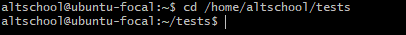

__b.__  Change directory to the tests directory using relative pathname
__solution__

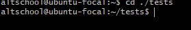

__c.__  Use echo command to create a file named fileA with text content ‘Hello A’ in the misc directory

__solution__
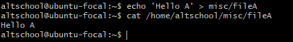

__d.__  Create an empty file named fileB in the misc directory.Populate the file with a dummy content afterwards

__solution__
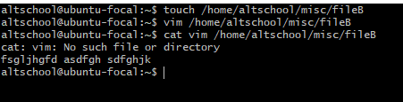

__e.__  Copy contents of fileA into fileC

__solution__
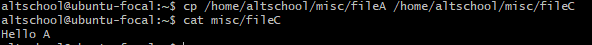

__f.__  Move contents of fileB into fileD

__solution__
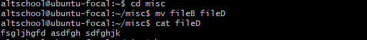

__g.__  Create a tar archive called misc.tar for the contents of misc directory

__solution__

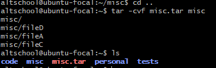

__h.__  Compress the tar archive to create a misc.tar.gz file

__solution__

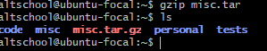

__i.__  Create a user and force the user to change his/her password upon login

__solution__

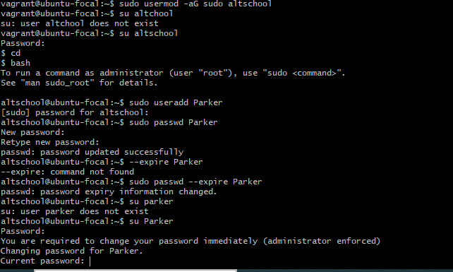

__j.__  Lock a users password
__solution__

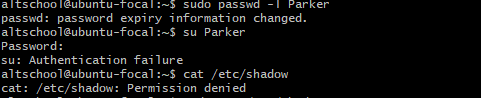

__k.__  Create a user with no login shell

__solution__

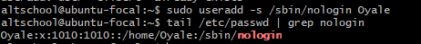

__l.__  Disable password based authentication for ssh
__solution__

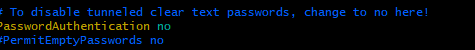

__m.__   Disable root login for ssh

__solution__

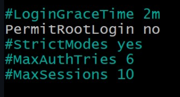